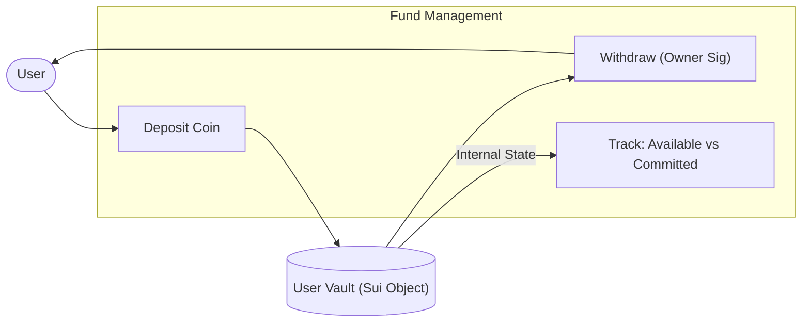
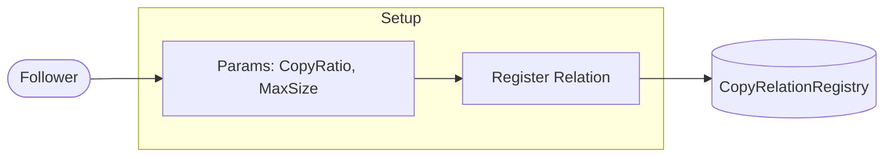
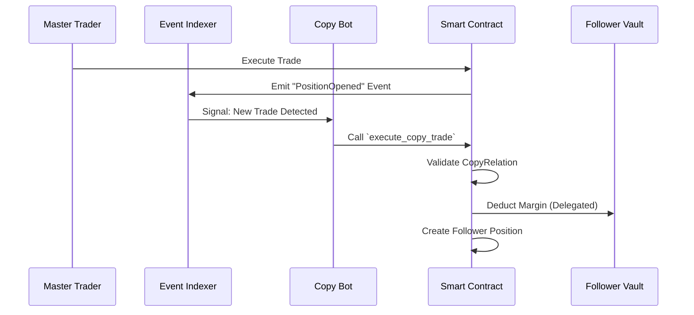
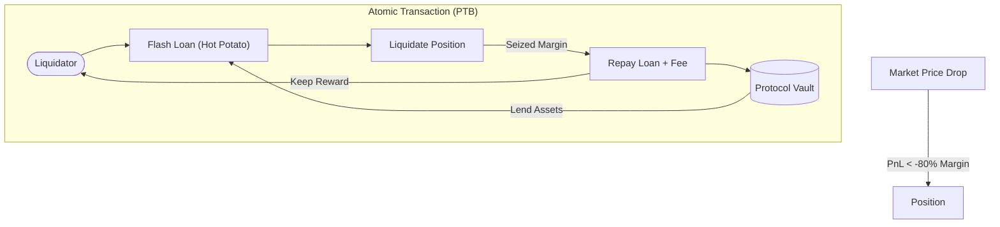
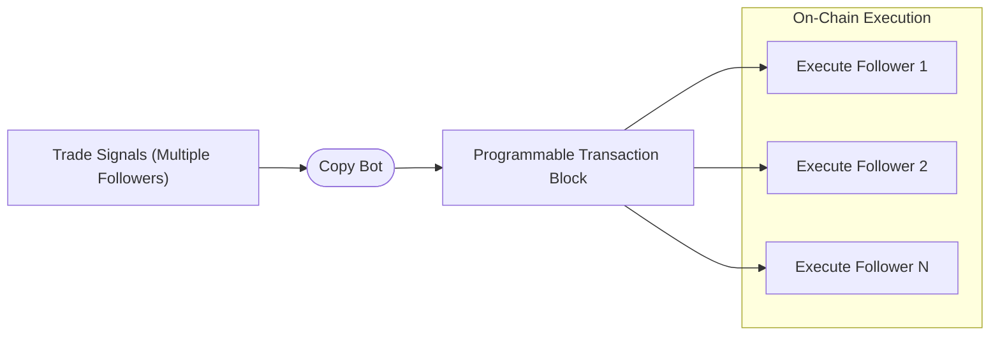

# MarginMaster

**The Decentralised Social Copy Trading Protocol on Sui Network**


**MarginMaster** is a trustless, non-custodial copy trading platform that democratises access to institutional-grade trading strategies. By leveraging the unique object-centric architecture of the **Sui Blockchain**, we enable real-time, gas-efficient social trading where users retain full sovereignty over their funds.

---

## 🚀 Key Features

*   **Non-Custodial Design:** Your funds remain in your personal `Vault` object. You never deposit assets into a black-box exchange wallet.
*   **One-Click Copy Trading:** Automatically mirror the trades of top-performing "Master Traders" with a configurable copy ratio and risk caps.
*   **Flash Liquidation:** Innovative "Hot Potato" pattern allows liquidators to secure the protocol using flash loans, requiring **zero upfront capital**.
*   **Batch Execution:** Our backend bundles copy trades for hundreds of followers into single Programmable Transaction Blocks (PTBs), drastically reducing gas costs.
*   **Transparent Leaderboard:** Every statistic (PnL, Win Rate) is verifiable on-chain. No faked performance history.

---

## 🏗 Architecture & Contract Flows

### 1. Fund Management (Vault System)

Users deposit funds into their personal `Vault`. The vault tracks available liquidity for new trades and committed margin for open positions. Withdrawals are strictly gated by the owner's signature.



### 2. Copy Trading Setup

A follower creates a `CopyRelation` on-chain, specifying which Master Trader to follow and the parameters for the relationship (e.g., copy 10% of their trade size).



### 3. Delegated Copy Execution

When a Master Trader executes a trade, our Event Indexer detects it and signals the Copy Bot. The Bot constructs a transaction that proves the relationship exists and executes the trade on behalf of the follower.



### 4. Zero-Capital Liquidation (Flash Loan)

Our novel liquidation mechanism allows liquidators to borrow funds from the protocol to liquidate underwater positions, repaying the loan in the same transaction.



### 5. Batch Execution (Gas Optimisation)

To ensure scalability, copy trades are bundled.



---

## 🛠 Tech Stack

*   **Smart Contracts:** Sui Move (v2024.beta)
*   **Frontend:** React, Vite, Tailwind CSS, Radix UI
*   **Backend:** Node.js, Express, Socket.IO
*   **Database:** PostgreSQL (Supabase), Prisma ORM
*   **Indexing:** Custom Event Indexer (Sui SDK)

---

## 📦 Deployment (Sui Testnet)

| Component | Address / ID |
| :--- | :--- |
| **Package ID** | `0x361681e0d8b2fdca428a4c4afb9e27af251a0fc3b543e4cb8738d2510a449ca4` |
| **CopyRelationRegistry** | `0x452e7b7822f255e40f5df3d075d18b292a72cd315502a744598d45fb6f580672` |
| **Frontend** | [https://sui-margin-master.vercel.app](https://sui-margin-master.vercel.app) |
| **Backend API** | [https://margin-master-backend-prd.up.railway.app](https://margin-master-backend-prd.up.railway.app) |

---

## 🏁 Getting Started

### Prerequisites
*   Node.js v20+
*   pnpm v8+
*   Sui CLI

### Installation

```bash
# Clone the repository
git clone https://github.com/ramonliao/margin-master.git

# Install dependencies
pnpm install

# Run Frontend
cd packages/frontend && pnpm dev

# Run Backend (requires .env)
cd packages/backend && pnpm dev
```

---

## 🏆 Hackathon Submission

Built for **ETHGlobal HackMoney 2026**.

**Team:**
*   **Ramon Liao** - Full Stack & Smart Contracts

> *Disclaimer: This project is a prototype built for a hackathon. Use at your own risk.*
